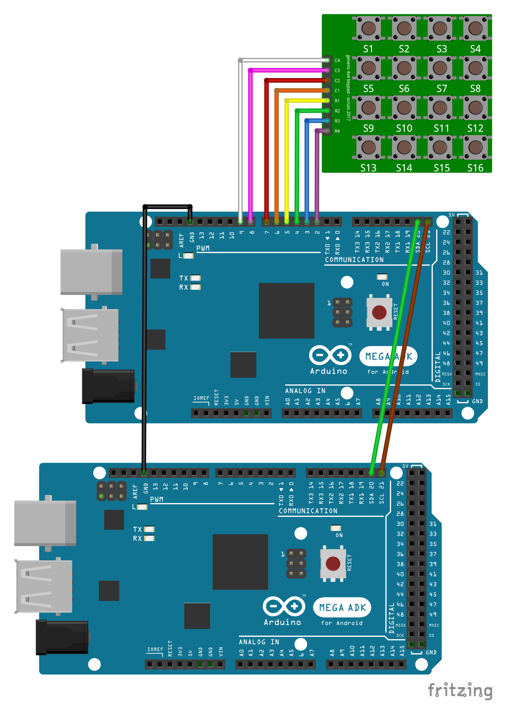
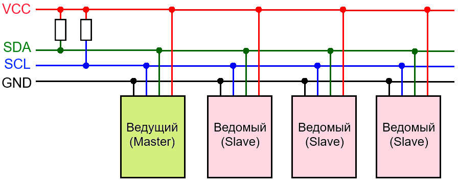

# I2C
*Последовательный протокол обмена данными IIC (Inter-Integrated Circuits)*

## Оглавление
1. [Примеры подключения к Arduino](#connection-example)
3. [Библиотека Wire для работы с I2C](#wire)
4. [Пример скетча](#example)
5. [Описание](#description)
6. [Ссылки](#links)

<a name="connection-example"></a>
## Примеры подключения к Arduino



<a name="wire"></a>
## Библиотека Wire для работы с I2C

Для облегчения обмена данными с устройствами по шине I2C для Arduino написана стандартная библиотека [Wire](https://www.arduino.cc/en/Reference/Wire). Она имеет следующие функции:

```c++
begin(address); // инициализация библиотеки и подключение к шине I2C; если не указан адрес, то присоединённое устройство считается ведущим; используется 7-битная адресация;

requestFrom(); // используется ведущим устройством для запроса определённого количества байтов от ведомого;

beginTransmission(address) // начало передачи данных к ведомому устройству по определённому адресу;

endTransmission() // прекращение передачи данных ведомому;

write(); // запись данных от ведомого в ответ на запрос;

available(); // возвращает количество байт информации, доступных для приёма от ведомого;

read(); // чтение байта, переданного от ведомого ведущему или от ведущего ведомому;

onReceive();	// указывает на функцию, которая должна быть вызвана, когда ведомое устройство получит передачу от ведущего;

onRequest();	// указывает на функцию, которая должна быть вызвана, когда ведущее устройство получит передачу от ведомого.

```

<a name="example"></a>
## Пример скетча

#### Sender

```c++
#include <Wire.h>

const char keyUp = 'U';
const char keyDown = 'D';
const char keyRight = 'R';
const char keyLeft = 'L';
const char keyNone = 'N';

const byte rowAmount = 4;
const byte colAmount = 4;

char keyMatrix[rowAmount][colAmount] = {
  {keyNone, keyUp,    keyNone,  keyNone},
  {keyLeft, keyNone,  keyRight, keyNone},
  {keyNone, keyDown,  keyNone,  keyNone},
  {keyNone, keyNone,  keyNone,  keyNone}
};

byte rowPins[rowAmount] = { 5, 4, 3, 2 };
byte colPins[colAmount] = { 6, 7, 8, 9 };

const int address = 10;

char currentKey = keyNone;

void setup()
{
  for (int i = 0; i < rowAmount; i++) {
    pinMode(rowPins[i], OUTPUT);
    digitalWrite(rowPins[i], HIGH);
  }

  for (int i = 0; i < colAmount; i++) {
    pinMode(colPins[i], INPUT);
    digitalWrite(colPins[i], HIGH);
  }
  
  Wire.begin(address);
  Wire.onRequest(handleRequest);
}

void loop()
{
  currentKey = getKey();
}

char getKey()
{
  char result = keyNone;
  for (int i = 0; i < rowAmount; i++) {
    for (int j = 0; j < colAmount; j++) {
      if (isKeyDown(i, j)) {
        return keyMatrix[i][j];
      }
    } 
  }
  return keyNone;
}

bool isKeyDown(int i, int j)
{
  bool result = false;
  digitalWrite(rowPins[i], LOW);
  if (digitalRead(colPins[j]) == LOW) {
    result = true;
  }
  digitalWrite(rowPins[i], HIGH);
  return result;
}

void handleRequest() {
  Wire.write(currentKey);
}

```

#### Poller

```c++
#include <Wire.h>

const char keyNone = 'N';
char lastKey = keyNone;

const int keypadAdderss = 10;

void setup()
{
  Serial.begin(115200);
  Wire.begin();
}

void loop()
{
  Wire.requestFrom(keypadAdderss, 1);
  while (Wire.available()) {
    char key = Wire.read();
    if (key != keyNone && key != lastKey) {
      Serial.println(key);
    }
    lastKey = key;
  }
}

```

<a name="description"></a>
## Описание

Последовательный протокол обмена данными IIC (также называемый I2C – Inter-Integrated Circuits, межмикросхемное соединение) использует для передачи данных две двунаправленные линии связи, которые называются шина последовательных данных SDA (Serial Data) и шина тактирования SCL (Serial Clock). Также имеются две линии для питания. Шины SDA и SCL подтягиваются к шине питания через резисторы. 

В сети есть хотя бы одно ведущее устройство (Master), которое инициализирует передачу данных и генерирует сигналы синхронизации. В сети также есть ведомые устройства (Slave), которые передают данные по запросу ведущего. У каждого ведомого устройства есть уникальный адрес, по которому ведущий и обращается к нему. Адрес устройства указывается в паспорте (datasheet). К одной шине I2C может быть подключено до 127 устройств, в том числе несколько ведущих. К шине можно подключать устройства в процессе работы, т.е. она **поддерживает «горячее подключение»**.




<a name="links"></a>
## Ссылки

1. [Библиотека Wire](https://www.arduino.cc/en/Reference/Wire)
2. [Полезное видео с примером работы через I2C](https://www.youtube.com/watch?v=RcAg9XpgALI)