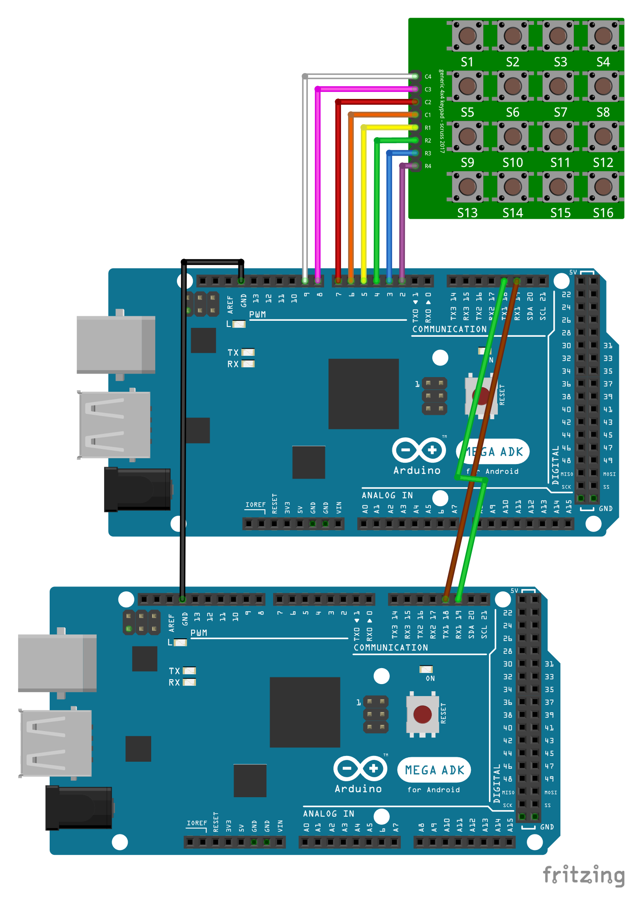

# Serial
*Служит для связи устройства Arduino с компьютером или другими устройствами, поддерживающими последовательный интерфейс обмена данными*

## Оглавление
1. [Примеры подключения к Arduino](#connection-example)
2. [Пример скетча](#example)
3. [Описание](#description)
4. [Функции Serial](#funcs)


<a name="connection-example"></a>
## Примеры подключения к Arduino



<a name="example"></a>
## Пример скетча

#### Sender 

```c++
const char keyUp = 'U';
const char keyDown = 'D';
const char keyRight = 'R';
const char keyLeft = 'L';
const char keyNone = 'N';

const byte rowAmount = 4;
const byte colAmount = 4;

char keyMatrix[rowAmount][colAmount] = {
  {keyNone, keyUp,    keyNone,  keyNone},
  {keyLeft, keyNone,  keyRight, keyNone},
  {keyNone, keyDown,  keyNone,  keyNone},
  {keyNone, keyNone,  keyNone,  keyNone}
};

static bool keyDownMatrix[rowAmount][colAmount];

byte rowPins[rowAmount] = { 5, 4, 3, 2 };
byte colPins[colAmount] = { 6, 7, 8, 9 };

void setup()
{
  for (int i = 0; i < rowAmount; i++) {
    pinMode(rowPins[i], OUTPUT);
    digitalWrite(rowPins[i], HIGH);
  }

  for (int i = 0; i < colAmount; i++) {
    pinMode(colPins[i], INPUT);
    digitalWrite(colPins[i], HIGH);
  }
  Serial1.begin(115200);
}

void loop()
{
  char key = getKey();
  if (key != keyNone) {
    Serial1.write(key);
  }
}

char getKey()
{
  char result = keyNone;
  for (int i = 0; i < rowAmount; i++) {
    for (int j = 0; j < colAmount; j++) {
      bool isDown = isKeyDown(i, j);
      if (!keyDownMatrix[i][j] && isDown) {
        result = keyMatrix[i][j];
      }
      keyDownMatrix[i][j] = isDown;
    } 
  }
  return result;
}

bool isKeyDown(int i, int j)
{
  bool result = false;
  digitalWrite(rowPins[i], LOW);
  if (digitalRead(colPins[j]) == LOW) {
    result = true;
  }
  digitalWrite(rowPins[i], HIGH);
  return result;
}

```

#### poller
```c++  
void setup()
{
  Serial.begin(115200);
  Serial1.begin(115200);
}

void loop()
{
  if (Serial1.available()) {
    char key = Serial1.read();
    Serial.println(key);
  }
}

```

<a name="description"></a>
## Описание

 Все платы Arduino имеют хотя бы один последовательный порт (UART, иногда называют USART). Для обмена данными Serial используют цифровые порты ввод/вывода 0 (RX) и 1 (TX), а также USB порт. Важно учитывать, что если вы используете функции Serial, то нельзя одновременно с этим использовать порты 0 и 1 для других целей.

Среда разработки Arduino имеет встроенный монитор последовательного интерфейса (Serial monitor). Для начала обмена данными необходимо запустить монитор нажатием кнопки Serial monitor и выставить ту же скорость связи (baud rate), с которой вызвана функция begin().

Плата Arduino Mega имеет три дополнительных последовательных порта: Serial1 на портах 19 (RX) и 18 (TX), Serial2 на портах на портах 17 (RX) и 16 (TX), Serial3 на портах на портах 15 (RX) и 14 (TX). Чтобы использовать эти порты для связи с компьютером понадобится дополнительные адаптеры USB-to-serial, т.к. они не подключены к встроенному адаптеру платы Mega. Для связи с внешним устройством через последовательный интерфейс соедините TX порт вашего устройства с RX портом внешнего устройства и RX порт вашего устройства с портом TX внешнего и соедините "землю" на устройствах. (Важно! Не подключайте эти порты напрямую к RS232 порту, это может повредить плату).

<a name="funcs"></a>
## Функции Serial

```c++
Serial.begin(speed); // Инициирует последовательное соединение и задает скорость передачи данных в бит/c.

Serial.end(); // Закрывает последовательное соединение, порты RX и TX освобождаются и могут быть использованы для ввод/вывода.

Serial.available(); // Функция получает количество байт(символов) доступных для чтения из последовательного интерфейса связи.

Serial.read(); // Cчитывает очередной доступный байт из буфера последовательного соединения.

Serial.flush(); // Ожидает окончания передачи исходящих данных.

Serial.print(val, [format]) // Передает данные через последовательный порт как ASCII текст. Эта функция может принимать различные типы данных. Так целые числа выводятся соответствующими им символами ASCII. Вещественные выводятся с помощью двух ASCII символов, для целой и дробной части. Байты передаются как символ с соответствующим номером. Симоволы и строки отсылаются как есть.

Serial.println(val, [format]) // Serial.print(val + "\r\n", [format])

Serial.write(val);
Serial.write(str);
Serial.write(buffer, lengthBuffer); // Функция передает данные как бинарный код через последовательное соединение. Данные послаются как один или серия байтов.

Serial.peek(); // Возвращает следующий доступный байт (символ) из буфера входящего последовательно соединения, не удаляя его из этого буфера.
```