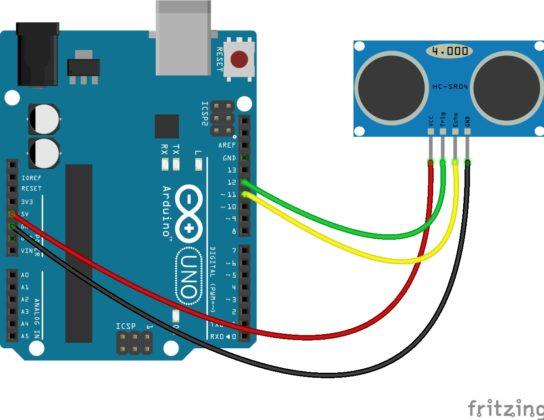

# Ультразвуковой датчик расстояния 

## Оглавление
1. [Примеры подключения к Arduino](#connection-example)
2. [Пример работы с датчиком в Arduino](#work-example)
3. [Библиотека NewPing](#newPing)
4. [Пример работы с датчиком, используя библиотеку NewPing](#work-with-newping-example)
5. [Принцип работы](#howwork)
6. [Точность измерения расстояния](#distance-measurement-accuracy)
7. [Ссылки](#links)


<a name="connection-example"></a>
## Примеры подключения к Arduino

 


<a name="work-example"></a>
## Пример работы с датчиком в Arduino
В данном скетче мы выполняем такую последовательность действий:
- Коротким импульсом (2-5 микросекунды) переводим датчик расстояния в режим эхолокации, при котором в окружающее пространство высылаются ультразвуковые волны с частотой 40 КГц.
- Ждем, пока датчик проанализирует отраженные сигналы и по задержке определит расстояние.
- Получаем значение расстояния. Для этого ждем, пока датчик выдаст на входе ECHO импульс, пропорциональный расстоянию. Мы определяем длительность импульса с помощью функции pulseIn, которая вернет нам время, прошедшее до изменения уровня сигнала (в нашем случае, до появления обратного фронта импульса).
- Получив время, мы переводим его в расстояние в сантиметрах путем деления значения на константу (для датчика SR04 это 29.1 для сигнала «туда», столько же для сигнала «обратно», что в сумме даст 58.2).

Если датчик расстояния не выполняет считывание сигнала, то преобразование выходного сигнала никогда не примет значения короткого импульса – LOW. Так как у некоторых датчиков время задержки варьируется в зависимости от производителя, рекомендуется при использовании указанных скетчей выставлять его значение вручную (мы это делаем в начале цикла).

```c++
#define PIN_TRIG 12
#define PIN_ECHO 11

long duration, cm;

void setup() {

  // Инициализируем взаимодействие по последовательному порту

  Serial.begin (9600);
  //Определяем вводы и выводы
  pinMode(PIN_TRIG, OUTPUT);
  pinMode(PIN_ECHO, INPUT);
}

void loop() {

  // Сначала генерируем короткий импульс длительностью 2-5 микросекунд.

  digitalWrite(PIN_TRIG, LOW);
  delayMicroseconds(5);
  digitalWrite(PIN_TRIG, HIGH);

  // Выставив высокий уровень сигнала, ждем около 10 микросекунд. В этот момент датчик будет посылать сигналы с частотой 40 КГц.
  delayMicroseconds(10);
  digitalWrite(PIN_TRIG, LOW);

  //  Время задержки акустического сигнала на эхолокаторе.
  duration = pulseIn(PIN_ECHO, HIGH);

  // Теперь осталось преобразовать время в расстояние
  cm = (duration / 2) / 29.1;

  Serial.print("Расстояние до объекта: ");
  Serial.print(cm);
  Serial.println(" см.");

  // Задержка между измерениями для корректной работы скеча
  delay(250);
}
```

<a name="newPing"></a>
## Библиотека NewPing

Особенностям библиотеки можно отнести:
- Возможность работы с различными ультразвуковыми датчиками;
- Может работать с датчиком расстояния всего через один пин;
- Отсутствие отставания на 1 секунду при отсутствии пинга эха;
- Для простой коррекции ошибок есть встроенный цифровой фильтр;
- Максимально точный расчет расстояния.


<a name="work-with-newping-example"></a>
## Пример работы с датчиком, используя библиотеку NewPing

```c++
#include <NewPing.h>

#define PIN_TRIG 12
#define PIN_ECHO 11

#define MAX_DISTANCE 200 // Константа для определения максимального расстояния, которое мы будем считать корректным.

// Создаем объект, методами которого будем затем пользоваться для получения расстояния.
// В качестве параметров передаем номера пинов, к которым подключены выходы ECHO и TRIG датчика

NewPing sonar(PIN_TRIG, PIN_ECHO, MAX_DISTANCE);

void setup() {
  // Инициализируем взаимодействие по последовательному порту на скорости 9600
  Serial.begin(9600);
}

void loop() {

  // Стартовая задержка, необходимая для корректной работы.
  delay(50);

  // Получаем значение от датчика расстояния и сохраняем его в переменную
  unsigned int distance = sonar.ping_cm();

  // Печатаем расстояние в мониторе порта
  Serial.print(distance);
  Serial.println("см");

}
```

<a name="howwork"></a>
## Принцип работы

Принцип действия состоит в следующем.  Прибор излучает звуковые колебания с частотой больше 20000 герц.  При встрече с объектом они отражаются, попадают в приемник, и фиксируется.  Электронная схема отсчитывает время, которое прошло с момента импульса до момента приема эха. Расстояние высчитывается по формуле: $R= t* \frac{V}{2}$, где t – время между импульсом и приемом эха, V —   скорость звука. Произведение делится на 2, потому что звуковые волны проходят путь, равный двойному расстоянию между объектом и датчиком.  Скорость звука в различных средах неодинаковая: в воздухе это 331 м/сек, в дереве –1500, в воде – 1430.

Расстояние, на котором обнаруживаются объекты – до 8 метров, при условии, что у них твердая и гладкая поверхность.  Если они изготовлены из мягкого, пористого материала, поглощающего звук – расстояние сокращается.


<a name="distance-measurement-accuracy"></a>
## Точность измерения расстояния
Точность датчика зависит от нескольких факторов:
- температуры и влажности воздуха;
- расстояния до объекта;
- расположения относительно датчика (согласно диаграммы излучения);
- качества исполнения элементов модуля датчика.

В основу принципа действия любого ультразвукового датчика заложено явление отражения акустических волн, распространяющихся в воздухе. Но как известно из курса физики, скорость распространения звука в воздухе зависит от свойств этого самого воздуха (в первую очередь от температуры). Датчик же, испуская волны и замеряя время до их возврата, не догадывается, в какой именно среде они будут распространяться и берет для расчетов некоторую среднюю величину. Фактор расстояния до объекта важен, т.к. растет вероятность отражения от соседних предметов, к тому же и сам сигнал затухает с расстоянием.

Также для повышения точности надо правильно направить датчик: сделать так, чтобы предмет был в рамках конуса диаграммы направленности. Проще говоря,  “глазки” должны смотреть прямо на предмет.

Для уменьшения ошибок и погрешности измерений обычно усредняются значения (несколько раз замеряем, убираем всплески, потом находим среднее);.


<a name="links"></a>
## Ссылки
1. [Библиотека NewPing](http://robocraft.ru/files/sensors/Ultrasonic/HC-SR04/ultrasonic-HC-SR04.zip)