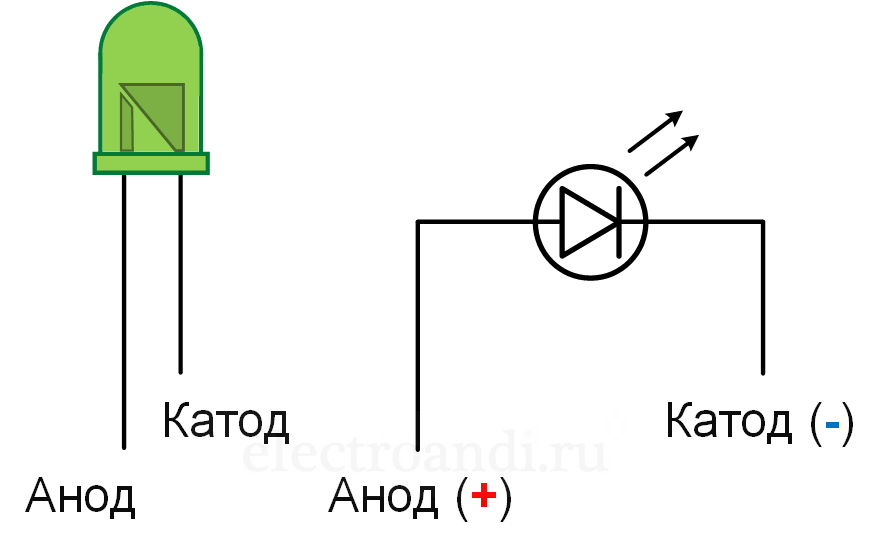

# Светодиоды

## Принцип работы

Светодиод является разновидностью диода. Ключевое отличие - светодиод при прохождении через него тока излучает свет.

У светодиода, как и у любого диода, есть две ножки - анод (`+`, обычно длинная ножка) и катод (`-` или `земля`, обычно короткая ножка).

Ток может идти лишь в одном направлении - от анода к катоду. Ток в обратном направлении блокируется.

Чем больше разность напряжения на ножках, тем ярче свечение.

## RGB светодиод

В отличие от обычного светодиода, RGB светодиод позволяет управлять цветом свечения, по отдельности задавая яркость каждой компоненты цвета (красной, зеленой и синей).

По сути, это просто три обычных светодиода с общим анодом и различными катодами. Яркость каждой компоненты цвета определяется уровнем напряжения на соответствующем катоде.
