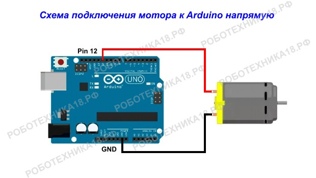
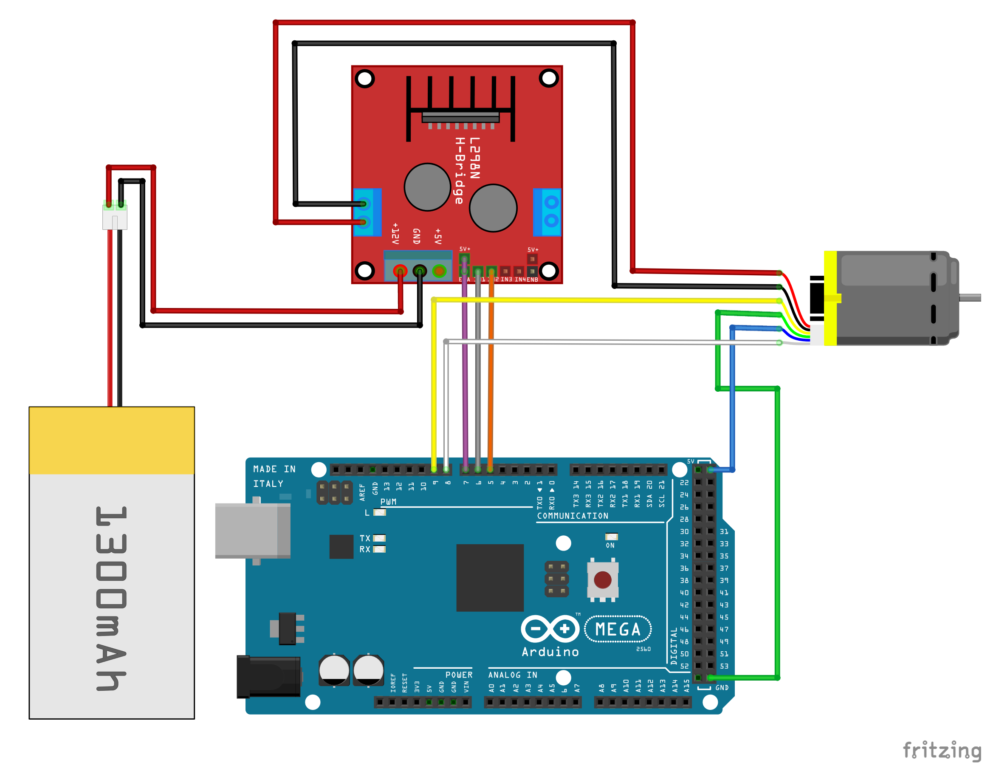

# Двигатель постоянного тока

## Оглавление
1. [Устройство](#device)
2. [Управление](#control)
3. [Подключение напрямую](#direct-connection)
   1. [Пример](#example_1)
4. [Подключение через драйвер](#connection-via-driver)
   1. [Пример](#example_2)

<a name="device"></a>
## Устройство


На схеме показано устройство моторчика постоянного тока и принцип его работы. Как видите, для того, чтобы ротор двигателя начал крутиться к нему необходимо подключить питание. При смене полярности питания, ротор начнет крутиться в обратную сторону.

<a name="control"></a>
## Управление

Коллекторный моторчик может быть рассчитан на разное напряжения питания. Если двигатель работает от 3-5 Вольт, то можно моторчик подключать напрямую к плате Ардуино. Моторы для машинки с блютуз управлением, которые идут в комплекте с редукторами и колесами рассчитаны уже на 6 Вольт и более, поэтому ими следует управлять через полевой (биполярный) транзистор или через драйвер L298N.

<a name="direct-connection"></a>
## Подключение напрямую



Подключение мотора к Ардуино напрямую — самый простой вариант включения вентилятора на Arduino или машинки. Команда для включения двигателя не отличается, от команды при подключении светодиода к микроконтроллеру. Функция digitalWrite включает/выключает подачу напряжения на цифровой порт, к которому подключен двигатель постоянного тока.

<a name="example_1"></a>
### Пример

```c++
void setup() {
   pinMode(12, OUTPUT);
}

void loop() {
   digitalWrite(12, HIGH); // включаем мотор

   delay(1000); // ждем 1 секунду

   digitalWrite(12, LOW); // выключаем мотор

   delay(1000); // ждем 1 секунду
}
```


<a name="connection-via-driver"></a>
## Подключение через драйвер



<a name="example_2"></a>
### Пример
Простой протокол общения через Serial:
Посылаешь число, Arduino его парсит и посылает на драйвер

```c++
int speed_control = 6;
int in1 = 9;
int in2 = 8;
void setup() {
  Serial.begin(115200);
}

void loop() {
  if(Serial.available()){
     int value = Serial.parseInt();
     analogWrite(speed_control, value);
  }
}
```