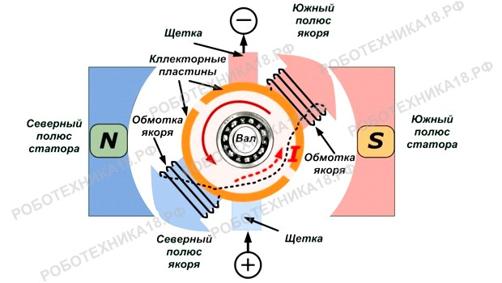

# Двигатель постоянного тока

## Оглавление
1. [Устройство](#device)
2. [Управление](#control)
3. [Назначение](#appointment)
4. [Формирование выходного сигнала](#output)
5. [Принцип работы](#howwork)
6. [Подбор Коэффициентов](#coeff)
7. [Настройка](#settings)

## Устройство

## Управление

Коллекторный моторчик может быть рассчитан на разное напряжения питания. Если двигатель работает от 3-5 Вольт, то можно моторчик подключать напрямую к плате Ардуино. Моторы для машинки с блютуз управлением, которые идут в комплекте с редукторами и колесами рассчитаны уже на 6 Вольт и более, поэтому ими следует управлять через полевой (биполярный) транзистор или через драйвер L298N.