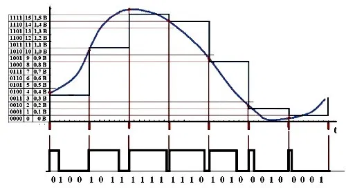

# Широтно-импульсная модуляция (ШИМ)
*Процесс управления мощностью методом пульсирующего включения и выключения прибора*
## Оглавление
1. [Принцип работы](#principle-of-operation)
   1. [Аналоговая](#analog)
   2. [Цифровая](#digit)
   2. [Применение](#application)

## Принцип работы
Задача ШИМ контроллера состоит в управлении силовым ключом за счёт изменения управляющих импульсов. Работая в ключевом режиме, транзистор находится в одном из двух состояний (полностью открыт, полностью закрыт). В закрытом состоянии ток через p-n-переход не превышает несколько мкА, а значит, мощность рассеивания стремится к нулю. В открытом состоянии, несмотря на большой ток, сопротивление p-n-перехода чрезмерно мало, что также приводит к незначительным тепловым потерям. Наибольшее количество тепла выделяется в момент перехода из одного состояния в другое. Но за счёт малого времени переходного процесса по сравнению с частотой 
модуляции, мощность потерь при переключении незначительна.

### Аналоговая

Принцип действия аналогового ШИ-модулятора основан на сравнении двух сигналов, частота которых отличается на несколько порядков. Элементом сравнения выступает операционный усилитель (компаратор). На один из его входов подают пилообразное напряжение высокой постоянной частоты, а на другой – низкочастотное модулирующее напряжение с переменной амплитудой. Компаратор сравнивает оба значения и на выходе формирует прямоугольные импульсы, длительность которых определяется текущим значением модулирующего сигнала. При этом частота ШИМ равна частоте сигнала пилообразной формы.

Функция ШИМ-регулирования вызывается при записи в соответствующий выход (3, 5, 6, 9, 10, 11) значения от 0 до 255 командой AnalogWrite(pin, значение). Логика её работы изображена на графиках ниже.

### Цифровая
Период сигнала заполняется прямоугольными подымпульсами, и регулируется уже количество подымпульсов в периоде, что и определяет среднюю величину сигнала за период.

В цифровой ШИМ заполняющие период подымпульсы (или «единички») могут стоять в любом месте периода. Среднее значение напряжения за период определяется только их количеством, при этом подымпульсы могут следовать один за другим и сливаться. Отдельно стоящие подымпульсы приводят к ужесточению режима работы ключа.

В качестве источника сигнала цифровой ШИМ можно использовать COM-порт компьютера с 10-битовым сигналом на выходе. С учетом 8 информационных битов и 2 битов старт/стоп, в сигнале COM-порта присутствует от 1 до 9 «единичек», что позволяет регулировать напряжение в пределах 10-90% напряжения питания с шагом в 10%.

## Применение
Широтно-импульсное регулирование находит применение там, где требуется регулировать подаваемую к нагрузке мощность. Например, в схемах управления электродвигателями постоянного тока, в импульсных преобразователях, для регулирования яркости светодиодных светильников, экранов ЖК-мониторов, дисплеев в смартфонах и планшетах и т.п.

Большинство вторичных источников питания электронных устройств в настоящее время строятся на основе импульсных преобразователей, применяется широтно-импульсная модуляция и в усилителях низкой (звуковой) частоты класса D, сварочных аппаратах, устройствах зарядки автомобильных аккумуляторов, инверторах и пр. ШИМ позволяет повысить коэффициент полезного действия (КПД) вторичных источников питания в сравнении с низким КПД аналоговых устройств.