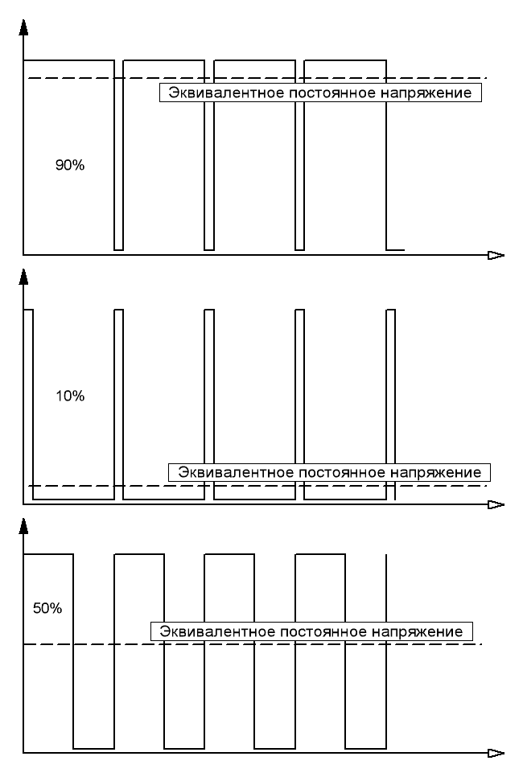

# Широтно-импульсная модуляция (ШИМ)
*Способ задания аналогового сигнала цифровым методом, то есть из цифрового выхода, дающего только нули и единицы получить какие то плавно меняющиеся величины.*
## Оглавление
1. [Принцип работы "на пальцах"](#principle-of-operation)
2. [Ссылки](#links)

## Принцип работы "на пальцах"
Представь себе тяжеленный маховик, который ты можешь вращать двигателем. Причем двигатель ты можешь либо включить, либо выключить. Если включить его постоянно, то маховик раскрутится до максимального значения и так и будет крутиться. Если выключить, то остановится за счет сил трения.
 
А вот если двигатель включать на десять секунд каждую минуту, то маховик раскрутится, но далеко не на полную скорость — большая инерция сгладит рывки от включающегося двигателя, а сопротивление от трения не даст ему крутится бесконечно долго.
 
Чем больше продолжительность включения двигателя в минуту, тем быстрей будет крутится маховик.
При ШИМ мы гоним на выход сигнал состоящий из высоких и низких уровней (применимо к нашей аналогии — включаем и выключаем двигатель), то есть нулей и единицы. А затем это все пропускается через интегрирующую цепочку (в аналогии — маховик). В результате интегрирования на выходе будет величина напряжения, равная площади под импульсами.

Меняя скважность (отношение длительности периода к длительности импульса) можно плавно менять эту площадь, а значит и напряжение на выходе. Таким образом если на выходе сплошные 1, то на выходе будет напряжение высокого уровня. А если 50% времени будет высокий уровень, а 50% низкий, то в результате будет среднее.

## Ссылки
1. [Подробнее про ШИМ](PWM-more-details.md)