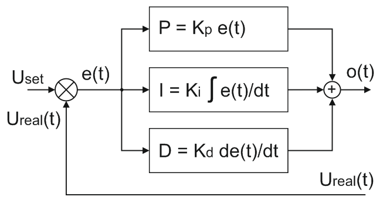

# ПИД - регулятор
*Пропорционально-интегрально-дифференцирующий (ПИД) регулятор*
## Оглавление
1. [Определение](#definition)
2. [Назначение](#appointment)
3. [Формирование выходного сигнала](#output)
4. [Принцип работы](#howwork)
5. [Подбор Коэффициентов](#coeff)
6. [Настройка](#settings)
7. [Ссылки](#links)

## Определение

Устройство в управляющем контуре с обратной связью. Используется в системах автоматического управления для формирования управляющего сигнала с целью получения необходимых точности и качества переходного процесса.

## Назначение

Главной задачей регуляторов является поддержание заданного значения $x_0$ некоторой величины $x$ с помощью изменения другой величины $u$. 
Значение $x_0$ называется заданным значением (или уставкой, в технике), а разность $e = (x_0 − x)$ — невязкой (или ошибкой регулирования), рассогласованием или отклонением величины от заданной.

## Формирование выходного сигнала

Математическая форма записи закона ПИД регулятора имеет вид: 

$$u(t) = P + I + D = K_P * e(t) + K_I * \int_0^t e(\theta)d(\theta) + K_D * \frac{d(e(t))}{d(t)}, где$$

- $u(t)$ - выходной сигнал
- $e(t)$ - невязка
- $P$ - Пропорциональная составляющая – значение пропорционально невязке.
- $I$ - Интегрирующая составляющая – интеграл невязки
- $D$ - Дифференцирующая составляющая – производная невязки
- $K_P$, $K_I$, $K_D$ - Коэффициенты пропорциональной, интегрирующей и дифференцирующей составляющих соответственно

Если какие-то из составляющих не используются, то регулятор называют пропорционально-интегрирующим, пропорционально-дифференцирующим, пропорциональным и т. д. 

## Принцип работы

1. Измеренное напряжение $U_{real}(t)$ вычитается из заданного $U_{set}$
   
2. Полученная ошибка рассогласования $e(t)$ поступает на пропорциональное, интегрирующее и дифференцирующее звенья.
   
3. В результате суммы составляющих получается управляющее воздействие $u(t)$, которое подается на регулирующий элемент.

При программной реализации ПИД регулятора вычисления выходного сигнала происходят через равные промежутки времени.

## Подбор коэффициентов

## Настройка

Составляющие ПИД регулятора настраиваются отдельно.

1. Отключается интегрирующее и дифференцирующее звенья и выбирается коэффициент пропорционального звена. Если регулятор пропорционально-интегрирующий (отсутствует дифференцирующее звено), то добиваются полного отсутствия колебаний на переходной характеристике. При настройке регулятора на высокое быстродействие колебания могут остаться. Их попытается скомпенсировать дифференцирующее звено.
   
2. Подключается дифференцирующее звено. Его коэффициентом стремятся убрать колебания параметра регулирования. Если не удается, то уменьшают пропорциональный коэффициент.
   
3. За счет интегрирующего звена убирают остаточную ошибку рассогласования.

Настройка ПИД регулятора носит итерационный характер. Т.е. пункты подбора коэффициентов могут многократно повторяться до тех пор, пока не будет достигнут приемлемый результат.