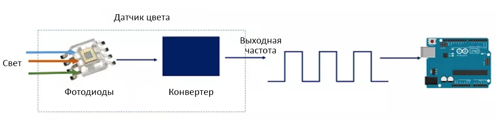

# Датчик цвета

## Оглавление
1. [Пример подключения к Arduino](#connection-example)
2. [Калибровка](#calibrate)
3. [Принцип работы](#howwork)
4. [Ссылки](#links)


<a name="connection-example"></a>
## Пример подключения к Arduino


<a name="calibrate"></a>
## Калибровка

Калибровка должна выполняться при хорошем освещении и на одинаковом расстоянии до предмета. При изменении освещенности в помещении или расстояния до предмета — все настройки могут сбиться.

Скетч для калибровки: 

```c++
#include <MD_TCS230.h>
#include <FreqCount.h>

#define  S0_OUT  2
#define  S1_OUT  3
#define  S2_OUT  4
#define  S3_OUT  5

MD_TCS230	CS(S2_OUT, S3_OUT, S0_OUT, S1_OUT);

void setup() 
{
  Serial.begin(115200);
  Serial.println("Press enter to start calibration");
  blockingRead();

  CS.begin();
}

void loop() 
{
    calibrate();
}

String blockingRead()
{
    while (!Serial.available())
        ;
    String command = Serial.readStringUntil('\n');
    return command;
}

void calibrate()
{
    sensorData blackCalibration, whiteCalibration;

    readRaw(blackCalibration, "BLACK");
    CS.setDarkCal(&blackCalibration);

    readRaw(whiteCalibration, "WHITE");
    CS.setWhiteCal(&whiteCalibration);

    Serial.println("Calibration values:");
    Serial.println();
    printCalibration("whiteCalibration", whiteCalibration);
    printCalibration("blackCalibration", blackCalibration);

    Serial.println("Press enter to read RGB value. Send 'retry' to calibrate again");
    while (true)
    {
        String command = blockingRead();
        if (command == "retry")
        {
            return;
        }

        colorData rgb;
        readRgb(rgb);
    }
}

void readRaw(sensorData& sd, const char* cardColor)
{
    Serial.print("Put ");
    Serial.print(cardColor);
    Serial.println(" card on the sensor and press enter");
    blockingRead();

    CS.read();
    while (!CS.available())
        ;
    CS.getRaw(&sd);

    Serial.print(cardColor);
    Serial.println(" calibration finished");
}

void readRgb(colorData& cd)
{
    Serial.println("Reading RGB...");
    
    CS.read();
    while (!CS.available())
        ;
    CS.getRGB(&cd);

    Serial.print(cd.value[TCS230_RGB_R]);
    Serial.print(' ');
    Serial.print(cd.value[TCS230_RGB_G]);
    Serial.print(' ');
    Serial.print(cd.value[TCS230_RGB_B]);
    Serial.println();
}

void printCalibration(const char* variableName, const sensorData& sd)
{
    Serial.print("sensorData "); Serial.print(variableName); Serial.println(";");
    printAssignment(variableName, "R", sd.value[TCS230_RGB_R]);
    printAssignment(variableName, "G", sd.value[TCS230_RGB_G]);
    printAssignment(variableName, "B", sd.value[TCS230_RGB_B]);
}

void printAssignment(const char* variableName, const char* color, int32_t value)
{
    Serial.print(variableName);
    Serial.print(".value[TCS230_RGB_");
    Serial.print(color);
    Serial.print("] = ");
    Serial.print(value);
    Serial.println(";");
}
```


<a name="howwork"></a>
## Принцип работы (На примере TCS230)

Датчик TCS230, расположенный в центре платы, состоит из фотодиодов четырёх типов: 16 фотодиодов с красным фильтром, 16 фотодиодов с зелёным фильтром, 16 фотодиодов с синим фильтром и 16 фотодиодов без светофильтра .

 К датчику подносят образец одного из трёх цветов — красного, зелёного или синего. Образец освещается светодиодами на плате вокруг датчика. Датчик имеет преобразователь тока в частоту, он преобразует показания фотодиодов в квадратную волну с частотой, пропорциональной интенсивности света выбранного цвета. Эта частота затем считывается Arduino.



<a name="links"></a>
## Ссылки
1. [Библиотека MD_TCS230](https://www.arduinolibraries.info/libraries/md_tcs230)
2. [Библиотека FreqCount](https://www.arduinolibraries.info/libraries/freq-count)