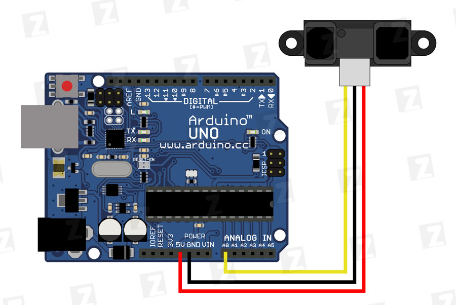
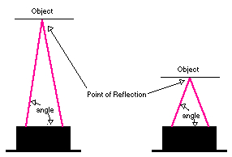

# Инфракрасный датчик расстояния 

## Оглавление
1. [Пример подключения к Arduino](#connection-example)
2. [Пример работы с датчиком в Arduino](#work-example)
3. [Библиотека SharpIR](#SharpIR)
4. [Пример работы с датчиком, используя библиотеку SharpIR](#work-with-SharpIR-example)
5. [Принцип работы](#howwork)
6. [Ссылки](#links)

<a name="connection-example"></a>
## Пример подключения к Arduino

 

<a name="work-example"></a>
## Пример работы с датчиком в Arduino

```c++

int IRpin = 0;   // аналоговый пин для подключения выхода Vo сенсора

void setup() {
  Serial.begin(9600);  // старт последовательного порта
}

void loop() {
  // 5V/1024 = 0.0048828125
  float volts = analogRead(IRpin) * 0.0048828125;   // считываем значение сенсора и переводим в напряжение
  float distance = 65 * pow(volts, -1.10); 
  Serial.println(distance);      // выдаём в порт
  delay(100);                   // ждём

```

<a name="SharpIR"></a>
## Библиотека SharpIR

Действие библиотеки заключено в следующих пунктах:
- Выполняется 25 измерений посредством AnalogRead
- Сортируются значения 
- выдается медиана измерений в сантиметрах

<a name="work-with-SharpIR-example"></a>
## Пример работы с датчиком, используя библиотеку SharpIR

```c++
#include <SharpIR.h>

#define ir A0 //пин, к которому подключен датчик. Обязательно аналоговый!
#define model 20150 //модель датчика. 1080 для GP2Y0A21Y, 20150 для GP2Y0A02Y

SharpIR SharpIR(ir, model);

void setup() {
  Serial.begin(9600);
}

void loop() {
  delay(2000);   

  unsigned long time1=millis();  // засекаем время до начала измерений

  int dis=SharpIR.distance();  // получаем расстояние с датчика


  Serial.print("Mean distance: ");  // выводим расстояние в монитор порта
  Serial.println(dis);
  
  unsigned long time=millis()-time1;  // считаем время, затраченное на измерение
  Serial.print("Time taken (ms): "); // и выводим его
  Serial.println(time);  
}
```


<a name="howwork"></a>
## Принцип работы

Для определения расстояния либо просто наличия объекта в поле зрения сенсора используется метод триангуляции и малая линейная CCD матрица.

Основная идея в следующем. Импульсы ИК излучения испускаются излучателем. Это излучение распространяется и отражается от обьектов находящихся в поле зрения сенсора. Отраженное излучение возвращается на приемник. Испускаемый и отраженный лучи образуют треугольник «излучатель — обьект отражения — приемник».



Угол отражения напрямую зависит от расстояния до обьекта. Полученные отраженные импульсы собираются высококачественной линзой и передаются на линейную CCD матрицу. По засветке определенного участка CCD матрицы определяется угол отражения и высчитывается растояние до обьекта.

Этот метод более защищен от эффектов интерференции излучения и разной отражающей способности поверхностей, выполненных из различных материалов и окрашенных в различные цвета. Например, стало возможно определение черной стены при ярком освещении. 

<a name="links"></a>
## Ссылки

1. [Библиотека SharpIR](https://www.arduinolibraries.info/libraries/sharp-ir)